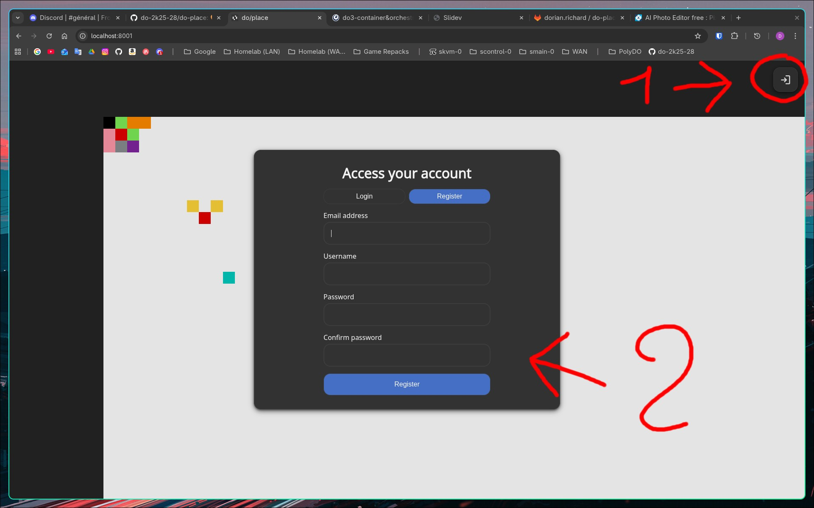
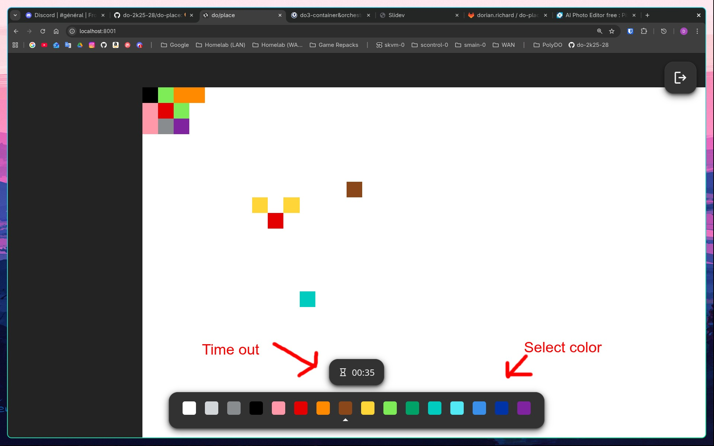

# do/place

A remake of Reddit's r/place for a school project.

## Launch the stack

Start by cloning this repository, also make sure to be on the `polytech` branch.

### Setting up secrets

Before jumping in your terminal like a maniac, a bit of manual configuration is required. This project uses Argon2 and JWTs which both requires secrets. Even though the Redis server is not exposed, it is required to setup a user when setting up a production environment.

Start by generating a strong password for Redis. Put the password in a file called `redis.txt` in the root directory of the project.

The `docker-compose.yaml` is configured to use the `doplace` user. You can either reuse this username or change the associated environment variable in the compose file.

Unfortunately, Redis doesn't offer user/password definition in environment variables so we need to manually create a config file (no we are not going to use the Bitnami image because I don't want my project to break if they decide to do something funny again). Continue by creating a `redis.conf` in the root directory and paste de following

```
user default off
user doplace on >[MY_STRONG_PASSWORD] ~* &* +@all
```

Replace `[MY_STRONG_PASSWORD]` with your own. Do not remove the `>`!

The JWT secret needs to be at least 256 bits long. That means you need to have at least 32 characters in the secret. Put it in `jwt.txt`.

Same thing for the Argon2 secret, put it in `hash.txt`.

You should end up with the following files in the root directory of the project.

```
.
├── LICENSE
├── README.md
├── docker-compose.yaml
├── hash.txt
├── jwt.txt
├── redis.conf
└── redis.txt
```

### Docker

Once those secrets are setup, we can create and start the containers by running

```sh
docker compose up
```

## Using the app

You can open http://localhost:8081 in your prefered browser.

In its current state the app doesn't have many features. However, you can already create an account, login and start drawing on the canvas.

You can either login and register by using the button in the top rigt hand corner. You'll be prompted to register if you never did before otherwise you can login.


Once logged in, you can choose what color you want to use and you can click on the canvas to place a pixel. You can place a pixel once per minute.


